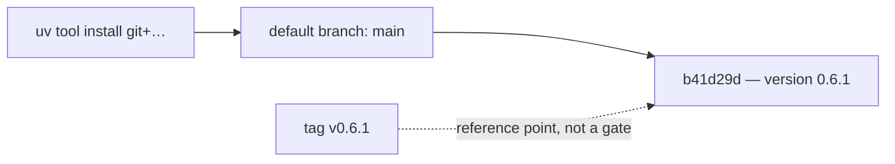

## What changed

`v0.6.1` is now an annotated tag on `b41d29d` and a
[GitHub release](https://github.com/b3008/devlog/releases/tag/v0.6.1). It is the
first of either in this repo's history.

That history had six version bumps in it — 0.2.0 (#14), 0.3.0 (#17), 0.6.0 (#18),
0.6.1 (#19) — none of which left a mark outside `pyproject.toml` and
`_version.py`:

```console
$ git tag --sort=-creatordate
backup-terser-output-pre-rebase

$ gh release list
(empty)
```

The one tag that existed was a rebase safety net, not a release.

## Why it matters

This started as a verification question — *is 0.6.1 actually deployed?* Every
layer said yes and agreed with every other layer: `origin/main` at `b41d29d`,
`pyproject.toml` at 0.6.1, the `uv`-installed binary at 0.6.1, the global
convention block stamped `v0.6.1`, and 25/25 projects OKF-conformant after the
[fleet sweep](2026-07-31-03-fleet-sweep.md). Nothing was broken. The gap was that
none of it was *anchored* to anything.

That mattered concretely, because `learned.md` has been carrying a proposed CI
check since the 07-31 audit: **assert `main`'s version is the highest released
version.** The audit wrote it after finding 0.3.0→0.6.0 sitting on a feature
branch while `main` still said 0.2.0 — which made the documented upgrade path a
downgrade. But the check was unwritable as stated: there were no releases, so
"the highest released version" had no referent. Six releases of version
discipline had been enforced entirely by remembering to do it.

## How it works

Distribution here is `uv tool install git+https://github.com/b3008/devlog.git`,
which resolves the repo's **default branch**. So `main` is the release channel,
and it stays the release channel after this — the tag doesn't change what anyone
installs. This is worth stating plainly rather than letting a tag imply
otherwise:



The tag points at `b41d29d` — current `main` — rather than at `efd415f`, the
commit that bumped the version. The two commits in between (#20, #21) are a
convention resync and a devlog entry, no code. Tagging the branch head keeps
"what the tag says" and "what `uv tool install` gives you" identical, which is
the property that actually matters given the diagram above.

## What's next

- **The CI check is now writable, and still unwritten.** A tag gives it a
  referent; nothing enforces it. That thread stays open.
- **Tags are reference points, not gates.** Nobody installs `v0.6.1` — they
  install `main`. Pinning would mean either publishing to PyPI or telling users
  `git+…@v0.6.1`, and neither is obviously worth it for a tool whose entire
  install base is one person's fleet.

## Surprises

The turn that produced this release was supposed to be a read-only status check,
and it ended with a devlog entry written about its own answer. The thing worth
noting is *how* the gap surfaced: not from anything failing, but from trying to
state the deployment status precisely enough to be useful. Every individual
version number was correct and mutually consistent; the question "correct
relative to what?" only came up because the answer had to be written down in a
table.

There's a smaller one. The line I added to `learned.md` mid-session — *"there is
no released version to compare against"* — was stale forty minutes later, by my
own hand. The convention's rule about annotating superseded claims in the same
turn usually applies across sessions; here it applied within one, which is a
decent argument that the rule is calibrated correctly.
